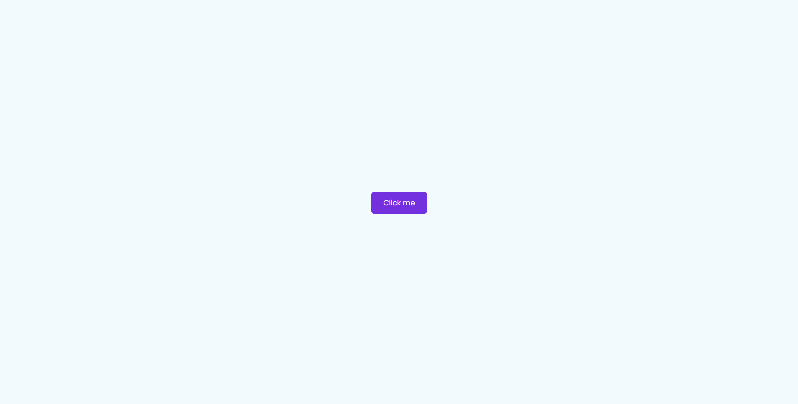

# 🎨 Button Animation Project

A simple and visually appealing **HTML & CSS Button Animation** project showcasing creative button effects for websites and applications.

## 📸 Screenshot

### ✨ Animated Button Example

## 🚀 Features

- 🎯 Smooth hover animations
- 🎨 Multiple button styles and effects
- ✅ Pure HTML & CSS — no external libraries
- 📱 Responsive design for all screen sizes
- 🌟 Easy to integrate in any web project

## 🛠️ Tech Stack

- Markup: **HTML5**
- Styling: **CSS3**

## 📌 Installation & Setup

### Prerequisites
Make sure you have:
- 📌 A modern browser (Chrome, Firefox, Edge, or Safari)
- 📌 A code editor (like VSCode)

### Steps
1. 📥 Clone the repository:
  
   git clone https://github.com/shelavalepallavi/button-animation.git

   
📁 Open the project folder in your code editor.

🌐 Open index.html in your browser to view the animations.

🎯 Usage
Copy the button code from index.html.

Add the CSS styles from style.css to your project.

Customize colors, text, and animations as per your design.

🚀 Deployment
You can deploy this project on platforms like:

GitHub Pages

🙌 Contributing
Pull requests are welcome! If you have creative button ideas, feel free to contribute.
